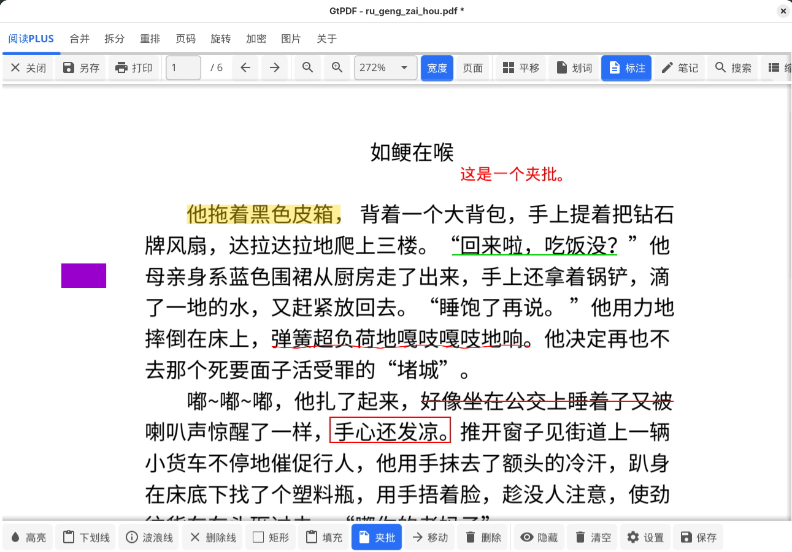

# GtPDF


跨平台 PDF 工具箱，基于 Go + [Fyne](https://fyne.io/) 构建。

> **系统要求**：Windows 10+ / Linux (glibc 2.28+)。Windows 7 及更早版本不受支持。

## 功能

- **阅读器** — 渲染、缩放 (0.1x–5x)、平移、文本选择、全文搜索、书签、链接、夜间模式、侧栏自适应
- **标注** — 高亮、下划线、波浪线、删除线、矩形（描边/填充）、线段、自由文本（支持 CJK）、填充（白色矩形）、9 色调色板
- **笔记** — JSON 侧载文件存储，悬停工具提示
- **OCR** — 选区或全页文字识别（中英文）
- **展开** — 旋转扫描件展平，自动检测 DPI
- **合并** — 多文件合并，支持页码范围选择
- **拆分** — 按 N 页或指定页码拆分
- **重排** — 页面顺序调整（置顶/置底/倒序/奇偶分离）
- **添加页码** — 多种格式/位置/颜色，支持奇偶页不同位置
- **旋转** — 90°/180° 旋转，可指定范围
- **加密/解密** — AES-256 加密与解密
- **导出** — 标注页导出 PNG，含进度提示
- **右键菜单** — 复制页成图、删除页面、夜间模式切换、笔记列表
- **打印** — 调用系统打印
- **快捷键** — Ctrl+J 下一页、Ctrl+K 上一页

## 依赖

- [pdfcpu](https://github.com/pdfcpu/pdfcpu) — PDF 处理 (Apache 2.0)
- [go-pdfium](https://github.com/klippa-app/go-pdfium) — PDFium Go 绑定 (Apache 2.0)
- [Fyne](https://fyne.io/) — GUI 框架 (MIT)
- WenQuanYi Micro Hei 中文字体 (GPLv3 + Font Exception)
- [PDFium](https://pdfium.googlesource.com/pdfium/) — 预编译二进制，编译时自动下载 (Apache 2.0 / MIT)

## 构建

> 需要 CGo。

### Linux (AMD64)

```bash
./build_linux_amd64.sh
```

### Linux (ARM64, glibc 2.28+)

```bash
./build_linux_arm64.sh        # 一次性构建
./build_linux_arm64_quick.sh  # 快速增量构建（持久容器）
```

### Windows 10+（从 Linux 交叉编译）

> Windows 7 及更早版本不支持（Go 1.21+ 已停止支持）。

```bash
./build_windows.sh
```

各脚本自动下载所需 PDFium SDK，生成独立二进制文件（Linux：单文件；Windows：exe + dll）。

## 开源协议

GPLv3 — 详见 [LICENSE](LICENSE)。

Copyright © 2026 gtlyy
